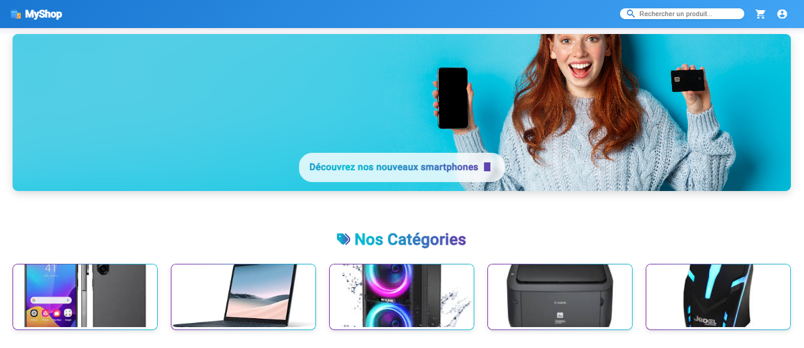
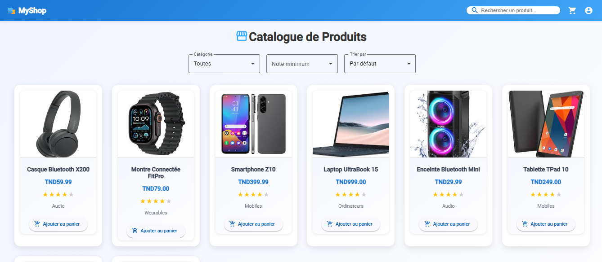
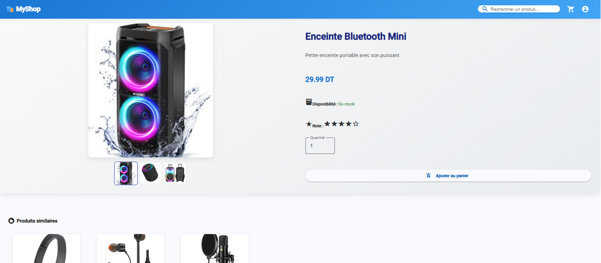
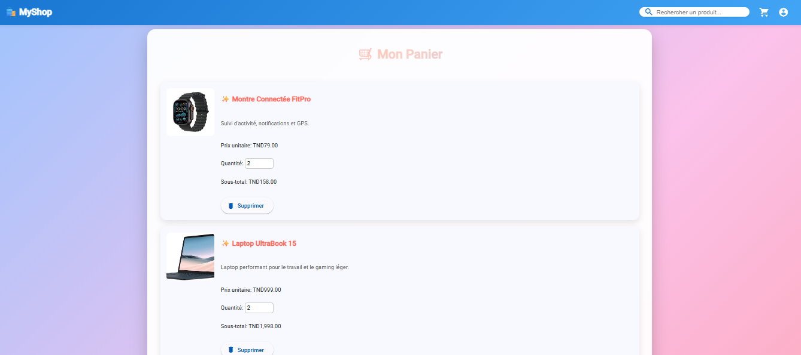
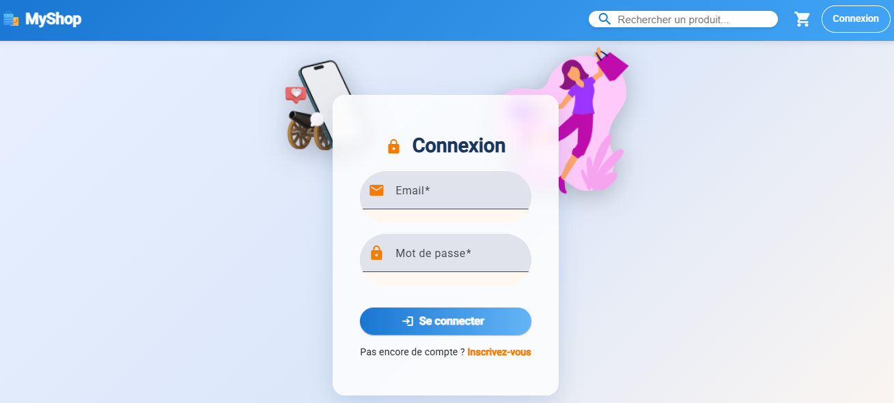
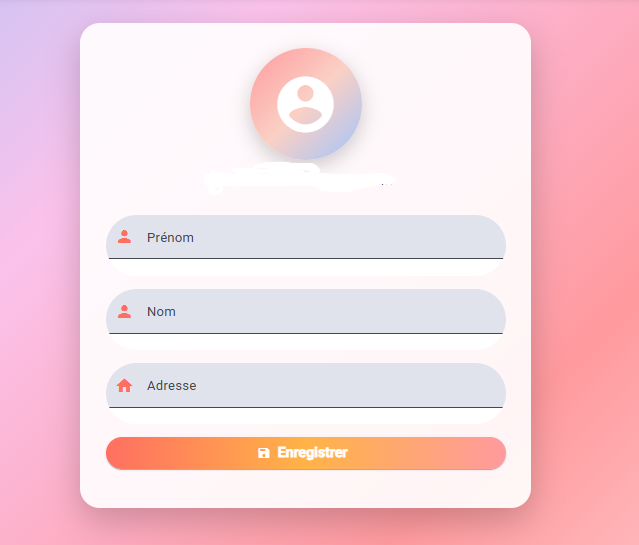

# EcommerceApp

This project was generated using [Angular CLI](https://github.com/angular/angular-cli) version 20.3.5.

## Development server

To start a local development server, run:

```bash
ng serve
```

Once the server is running, open your browser and navigate to `http://localhost:4200/`. The application will automatically reload whenever you modify any of the source files.

## Code scaffolding

Angular CLI includes powerful code scaffolding tools. To generate a new component, run:

```bash
ng generate component component-name
```

For a complete list of available schematics (such as `components`, `directives`, or `pipes`), run:

```bash
ng generate --help
```

## Building

To build the project run:

```bash
ng build
```

This will compile your project and store the build artifacts in the `dist/` directory. By default, the production build optimizes your application for performance and speed.

## Running unit tests

To execute unit tests with the [Karma](https://karma-runner.github.io) test runner, use the following command:

```bash
ng test
```

## Running end-to-end tests

For end-to-end (e2e) testing, run:

```bash
ng e2e
```

Angular CLI does not come with an end-to-end testing framework by default. You can choose one that suits your needs.

## Additional Resources

For more information on using the Angular CLI, including detailed command references, visit the [Angular CLI Overview and Command Reference](https://angular.dev/tools/cli) page.
............................................
# 🛍️ MyShop - Front-End E-Commerce Application

## Description
MyShop is a modern, responsive front-end e-commerce application built using **Angular 20**.  
It allows users to browse products, view details, manage a shopping cart, and authenticate.  
---


## 🧰 Technologies Used

- **Framework**: Angular 20  
- **Styling**: SCSS, Angular Material, Responsive design  
- **State Management**: Angular Services  
- **Mock Data / API**: JSON files / simulated API calls using Promises and `setTimeout`  
- **Version Control**: Git & GitHub  

---

## 📂 Project Structure

src/
├── app/
│ ├── shared/
│ │ ├── header/
│ │ ├── footer/
│ │ ├── product-card/
│ │ └── rating/
│ ├── features/
│ │ ├── auth/
│ │ ├── cart/
│ │ ├── home/
│ │ ├── orders/
│ │ ├── products/
│ │ ├── wishlist/
│ │ └── profile/
│ ├── core/
│ │   ├── auth.ts
│ │   ├── cart.ts
│ │   └── product.ts
│ └── app.module.ts
├── assets/
│ └── images/
└── styles.scss

---

## ⚡ Features Implemented

### 1. Home Page
- Carousel/slider for promotions & new products  
- Clickable category cards  
- Featured products grid (8+ products)  
- Search bar  
- Responsive navigation menu  

**Screenshot:**  


---

### 2. Product Catalog
- Product grid display (20+ products)  
- Product cards with image, name, price, rating, and "Add to Cart" button  
- Filters by category, price range, rating  
- Sorting by price, popularity, or newest  
- Pagination  

**Screenshot:**  


---

### 3. Product Details
- Image gallery (3+ images)  
- Product name, description, price, stock, technical specs  
- Quantity selector  
- Add to cart button  
- Recommended products  

**Screenshot:**  


---

### 4. Shopping Cart
- List of added products with mini-image, name, price, quantity, subtotal  
- Total summary with subtotal, shipping, and total  
- Remove products & update quantities  
- Persistence via localStorage  

**Screenshot:**  


---

### 5. Authentication
- Login page (email + password)  
- Registration page with validation (name, email, password, address)  
- Session simulation  

**Screenshot:**  


---

### 6. User Profile
- Edit profile ✅  
- View order history ✅  
- Manage saved addresses ✅  
- Wishlist/favorites  

**Screenshot:**  


---

## 🔧 How to Run Locally

1. Clone the repository:
```bash
git clone https://github.com/ChelbiSouha/ecommerce-app.git
cd myshop
## 🔧 Installation & Setup

2. **Install project dependencies**
```bash
npm install
3. Install Angular Material

ng add @angular/material
